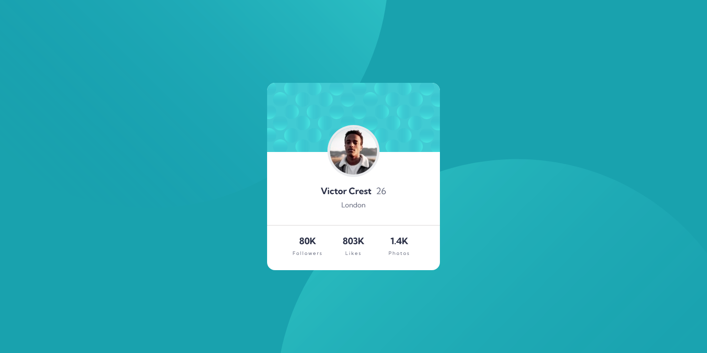
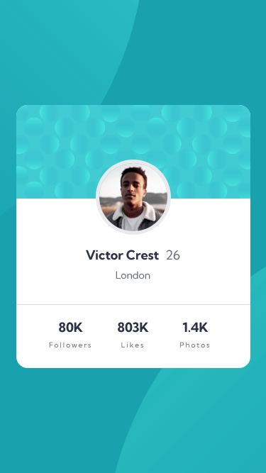

# Frontend Mentor - Profile card component solution

This is a solution to the [Profile card component challenge on Frontend Mentor](https://www.frontendmentor.io/challenges/profile-card-component-cfArpWshJ). Frontend Mentor challenges help you improve your coding skills by building realistic projects. 

## Table of contents

- [Overview](#overview)
  - [The challenge](#the-challenge)
  - [Screenshot](#screenshot)
  - [Links](#links)
- [My process](#my-process)
  - [Built with](#built-with)
  - [What I learned](#what-i-learned)
  - [Continued development](#continued-development)
  - [Useful resources](#useful-resources)
- [Author](#author)

## Overview

### Screenshot




### Links

- Solution URL: (https://github.com/dansuda/profile-card-component-main)
- Live Site URL: (https://dansuda.github.io/profile-card-component-main)

## My process

### Built with

- Semantic HTML5 markup
- CSS custom properties
- CSS Flexbox
- SASS/SCSS [https://sass-lang.com/]
- Mobile first workflow

### What I learned

Learned two new things today:
1. I learned that you can add two backgrounds in css and position them differently if they are the right size.
```css
body {
    background: url(../images/bg-pattern-top.svg), url(../images/bg-pattern-bottom.svg);
    background-repeat: no-repeat, no-repeat;
    background-position: right 45vw bottom 41vh, left 39vw top 45vh;
}
```
2. I learned that negative margins are a thing! So instead of positioning manually then tweaking top and left till you are satisfied, a simple `margin-block-start: -3.75rem;` did the job!

### Continued development

My growth in html and css is reaching the point where I can do 90% of projects comfortably except for parts I've never learned before. Huge progress!


### Useful resources

- (https://www.w3schools.com) - This helped me to understand how to use various css rules and how important they are. 
- (https://www.stackoverflow.com) - This is an amazing website which has really old questions but are still relevant to people like me today who seem to have joined this bandwagon very late. It's nice and helpful they've been around for so long.

## Author

- Github - [dansuda](https://www.github.com/dansuda)
- Frontend Mentor - [@dansuda](https://www.frontendmentor.io/profile/dansuda)